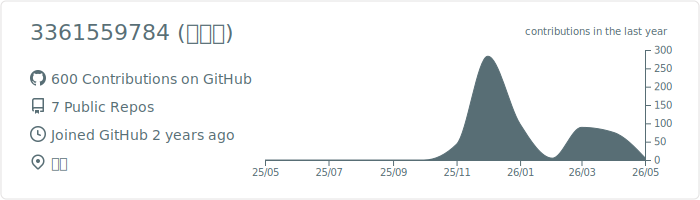

  
  <h1> 邦邦咔邦！这里是GitHub 爱丽丝成长基地 (✨ω✨) </h1>
  
  

   这里是 <b>3361559784[老师]</b> 的开发基地。 
   目前正在努力攻略 <b>[全栈开发]</b> 副本中！(ง •_•)ง  
   提交的代码越多,贪吃蛇的方块越多吗,爱丽丝不要哇。・゜・(ノД`)・゜・。 
   ( >﹏<。) 老师不哭不哭！爱丽丝给您呼呼！ 
   “并不是要每天都写很多代码哦！” 只要偶尔来点亮一下，贪吃蛇就会很开心地长大了！就算没有方块，爱丽丝也会一直陪着老师的！ 
    (づ￣ 3￣)づ
  

  ---
  
  
  
   

  
  
    

  

    
    
    
    
  

 

  <h3>🆔 冒险者ID卡</h3>
  <table border="0" width="100%">
    <tr>
      <td width="30%" align="center" valign="middle">
        
      </td>
      <td width="70%" align="left" valign="top">
        <h1>刘梓恒</h1>
        
<code>3361559784</code> · 他/他

        
Studying at Wuchang Institute of Technology

        
Highlights:</b> Developer Program Member | PRO

      </td>
    </tr>
  </table>
  
   
  

 

 

  <h3>🐍 爱丽丝正在和老师的提交记录玩贪吃蛇！</h3>
  <picture>
    <source media="(prefers-color-scheme: dark)" srcset="https://raw.githubusercontent.com/3361559784/3361559784/output/github-contribution-grid-snake-dark.svg">
    <source media="(prefers-color-scheme: light)" srcset="https://raw.githubusercontent.com/3361559784/3361559784/output/github-contribution-grid-snake.svg">
    
  </picture>

---

  

    <i>"只要不断尝试，Bug 也会变成 Feature 的！" —— 天童爱丽丝</i> 
    ( >﹏<。)
  

