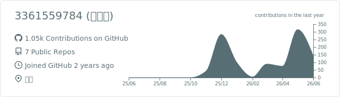
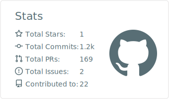

  

  <h1>邦邦咔邦! GitHub 爱丽丝云端基地</h1>

  

    <b>刘梓恒 / 3361559784</b> 
    AI Native Developer · Open-source contributor · Full-stack builder
  

  

    这里不是很正式的简历页。 
    更像一张正在更新的作战地图：AI Agent、MCP、桌面自动化、云端应用、开源协作，还有一点爱丽丝。
  

  

    
    
    
  

  

    

  

    

  

    
    
    
    
    
    
  

---

## 当前方向

### 1. Project AIRI / computer-use-mcp

最近主要在 [Project AIRI](https://github.com/moeru-ai/airi) 里做 `computer-use-mcp` 和 desktop / browser automation 相关的改动。

这条线大概分成几块：

**Coding runner / context**

- completion report、verification gate、budget exhausted、text-only final 这些收尾问题。
- transcript projection、archive recall、context budget policy。
- task memory、workspace memory、evidence pins，主要是防止上下文越写越脏。
- live eval 和 deterministic regression，避免只靠一次演示说“能跑”。

**Desktop / browser automation**

- Chrome semantic DOM bridge。
- iframe 坐标修正。
- desktop grounding / target candidates。
- overlay、ghost pointer、OS input boundary。
- Chrome-first 的桌面控制链路。

**MCP tool surface**

- tool schema、tool descriptor、public/internal boundary。
- approval、audit、trace。
- request / apply 这类需要分权限的状态变更。

<table>
<tr>
<td width="50%">

**AIRI execution line**

- MCP tool surface
- approval / audit / trace
- coding runner verification gate
- archive recall discipline
- task / workspace memory governance

</td>
<td width="50%">

**Desktop and browser line**

- Chrome semantic DOM bridge
- iframe coordinate grounding
- desktop target candidates
- overlay / ghost pointer state
- OS input safety boundaries

</td>
</tr>
</table>

这部分不往 title 上加戏，按实际贡献写：我主要是在补执行链路里的边界、测试、恢复路径和可审计信息。

### 2. Campus Copilot / Project Aris

Campus Copilot 和 Project Aris 是早一点的完整应用线。现在不再让它们占满整个主页，但还是值得保留。

做过的东西：

- QQ Bot 消息处理。
- 课表查询和多源导入。
- OCR 识别课表截图。
- 双人格和场景切换。
- Azure Functions / Cosmos DB / Next.js web demo。
- 流式响应、定时提醒、校园数据接入。

这条线的重点是校园场景和产品闭环。AIRI 这条线更偏执行系统、工具边界和开源协作。

### 3. AI governance

这里说的 governance 不是很大的概念，更多是工程里会直接遇到的问题：

- 哪些内容能进 prompt。
- 哪些工具能被模型直接调用。
- 哪些状态必须经过 review / token / host gate。
- 哪些记录只能当证据，不能当指令。
- 哪些失败要直接拦住，不能靠模型自己解释过去。

这块我现在不会写太深。先把实际系统里的小边界做好，比先写一套很大的原则更有用。

---

## 工程偏好

- 先看代码、测试、日志，再下结论。
- PR 尽量小，commit 拆清楚。
- baseline 够用就冻结，不在同一个分支里继续叠无关修补。
- 文档要跟实现、测试、脚本对得上。
- 能写 deterministic test 就不要只靠 live demo。
- Agent 系统要有 failure contract，不然出错以后很难接手。

---

## 工具箱

<table>
<tr>
<td width="33%">

**Runtime**

- TypeScript
- Node.js
- MCP server
- xsAI / tool calling
- Vitest

</td>
<td width="33%">

**Desktop**

- Electron
- Vue
- Eventa IPC
- Chrome bridge
- macOS automation

</td>
<td width="33%">

**Cloud / App**

- Azure Functions
- Cosmos DB
- Next.js
- GitHub Actions
- QQ Bot

</td>
</tr>
</table>

---

## Status Board

  

    

  

    

  <picture>
    <source media="(prefers-color-scheme: dark)" srcset="https://raw.githubusercontent.com/3361559784/3361559784/output/github-contribution-grid-snake-dark.svg">
    <source media="(prefers-color-scheme: light)" srcset="https://raw.githubusercontent.com/3361559784/3361559784/output/github-contribution-grid-snake.svg">
    
  </picture>

